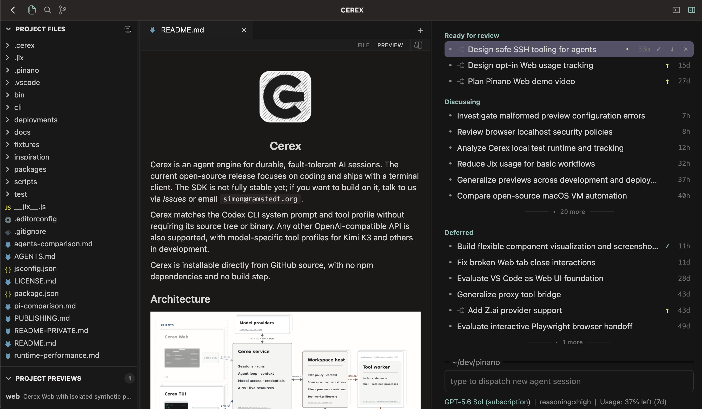
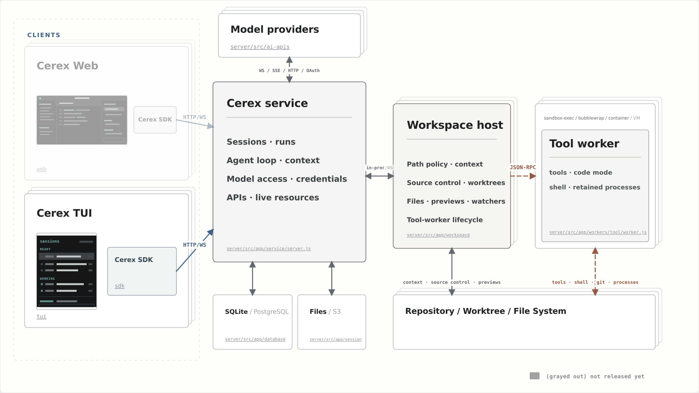

<p align="center">
<a href="docs/assets/cerex-web-preview.png"></a>
</p>

<p align="right">
<picture>
	<source media="(prefers-color-scheme: dark)" srcset="docs/assets/cerex-web-caption-dark.svg">
	
</picture>
</p>

<br>

Cerex is an agent engine for durable, fault-tolerant AI sessions. The current open-source release focuses on coding and ships with a terminal client. The SDK is not fully stable yet; if you want to build on it, talk to us via *Issues* or email `simonramstedt@gmail.com`.

Cerex matches the Codex CLI system prompt and tool profile without requiring its source tree or binary. Any other OpenAI-compatible API is also supported, with model-specific tool profiles for Kimi K3 and others in development.

Cerex is installable directly from GitHub source, with no npm dependencies and no build step.

## Architecture

<p>
<a href="docs/assets/cerex-architecture.png"></a>
</p>

<details>
<summary>Source layout</summary>

```text
cli/                         command-line composition root
packages/
  protocol/src/              shared transport and transcript presentation contracts
  sdk/src/                   runtime-independent client SDK
  server/src/
    agent-core/              AgentLoop + Agent (streamFn-driven), JSDoc types
    ai-apis/                 zero-dep OpenAI Chat-Completions / Responses / Codex clients
    tools/                   built-in coding and shell tools
    fallback-tools/          PATH fallbacks for common external commands
    session-manager/         SQLite + in-memory session storage
    app/                     service, workspace-host, and worker runtime
  tui/src/
    tui/                     reusable retained terminal UI framework
    app/                     Cerex terminal client
```

</details>

## Install

```bash
npm install -g github:rmst/cerex
cerex
```

Requires **Node ≥ 22.6**. Cerex is best tested on macOS and also runs on Linux and Windows through WSL 2. Linux and WSL 2 require Bubblewrap for sandboxing; Cerex can offer to continue without a sandbox when it is unavailable.

<details>
<summary>Clone and run directly</summary>

```bash
git clone https://github.com/rmst/cerex
./cerex/bin/cerex.js
```

</details>

On first run, Cerex opens the model provider credentials view when no provider is configured. Cerex is currently optimized for use with a ChatGPT subscription.

<details>
<summary>Install and first setup demo</summary>

<p>
<a href="#install"></a>
</p>

</details>

API keys are also supported. Cerex can import supported API keys from the launch environment. Deployment-level API keys and other settings can be configured declaratively; see [settings](docs/settings.md).

## Common commands

```bash
cerex                           # open the session overview
cerex open /sessions/<id>       # open a session directly
cerex service                   # show local service status
cerex --help
```

## Terminal client

Running `cerex` opens an overview of your sessions. Type a task and press `Enter` to start a background session in the current directory. Running sessions stay alive when you detach from the terminal, and the service shuts down automatically after all sessions are idle.

<details>
<summary>Terminal UI demo and reference</summary>

<p>
<a href="#terminal-client"></a>
</p>

Use `/model` from the overview to update the global default model for newly dispatched sessions.

Useful keys:

| Key | Action |
|---|---|
| `↑` / `↓` | select a session |
| `Enter` / `→` | open the selected session |
| `←` | return to the overview |
| `Ctrl+G` | return to the overview, including while composing text |
| `Space` | peek at the selected session or reply to it |
| `Esc` | interrupt an open running session |
| `Ctrl+X` | stop a selected running session |
| `Ctrl+C` | detach this terminal without stopping running sessions |

Type `/` to autocomplete. `/help` shows the full command list for the current view.

### Overview commands

| Command | What it does |
|---|---|
| `/model` | select the default model for new sessions |
| `/reasoning` | set the default reasoning effort for new sessions |
| `/usage` | show ChatGPT/Codex usage limits |
| `/settings` | edit local settings; includes credentials |

### Session commands

| Command | What it does |
|---|---|
| `/model` | select a compatible model for this session |
| `/rewind` | rewind to an earlier prompt or switch branch |
| `/branch` | create a new session from the current conversation branch |
| `/context` | show context usage details |
| `/fast on\|off\|status` | toggle Codex Fast mode when supported by the model |

In an open session, type `!cmd` to run a shell command directly. Use `!!cmd` to run it without adding the result to agent context.

Press `Ctrl+V` in the session or overview editor to paste an image from the system clipboard. On Linux this requires `wl-clipboard` (`wl-paste`) or `xclip`.

### Branching and rewind

`/branch` creates a new session from the current conversation point. The original session remains unchanged and both sessions can continue independently.

Press `Esc Esc` on an empty editor to open `/rewind`. You can return to an earlier prompt, switch to another branch tip, and optionally restore files changed through Cerex's edit tools.

</details>

*If you have questions or issues, ask Cerex itself. It has read-only access to its own source and documentation.*

## Tool environments

By default, tools run in a native filesystem sandbox on macOS and Linux. macOS uses `sandbox-exec`; Linux uses Bubblewrap (`bwrap`). You can optionally configure named local or container environments for tool execution.

Sandbox mount paths include the session's starting working directory. In the environments configuration, `mountPaths` adds other static host paths. Changing `cwd` does not add mounts or writable paths. Native workers allow reads from mounted paths plus system, toolchain, Cerex runtime paths, and the environment's tool home, while writes stay restricted to mounted paths, temporary directories, and the tool home.

<details>
<summary>Environment configuration</summary>

Create `~/.cerex/environments.json` to define explicit environments:

```json
{
	"default": "alpine",
	"environments": {
		"alpine": {
			"sandbox": {
				"type": "container",
				"image": "node:22-alpine",
				"mountPaths": [
					"/Users/me/dev"
				],
				"env": { "GH_TOKEN": "..." }
			}
		}
	}
}
```

</details>

## Project context

Cerex reads project instructions from `AGENTS.md` or `CLAUDE.md`:

1. Global instructions under `~/.cerex/`.
2. Instructions in ancestor directories of the current working directory.
3. Additional instructions in subdirectories when files there are read or modified.

### `@import`

`@<path>` references in normal Markdown text are replaced with that file's contents. Relative paths resolve against the importing file; `~/` expands to `$HOME`. Inline code and fenced code blocks are left alone.

```md
# project rules
See @README for project overview.
@./conventions.md
@~/.cerex/personal-style.md
```

## Notes

- Cerex was initially called Pinano and was based on [Pi](https://github.com/earendil-works/pi).
- Cerex also runs on the experimental [Qn](https://github.com/rmst/qn) runtime.
